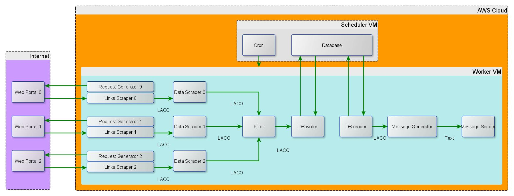

# andrzej-notifying-service
This service notifies Andrzej about thnigs nad stuff

LACO - List of Advertisement Class Objects

Stack:
Ubuntu Server 20.04 LTS (HVM), SSD Volume Type - ami-0502e817a62226e03 (64-bit x86) / ami-0489277f0e9a94f8d (64-bit Arm)
sudo apt-get install nano xorg lxde-core tightvncserver

Python 3.8.5
Pip 20.0.2
ChromeDriver 87.0.4280.88
Chromium-chromedriver
Selenium
fbchat
wappdriver
